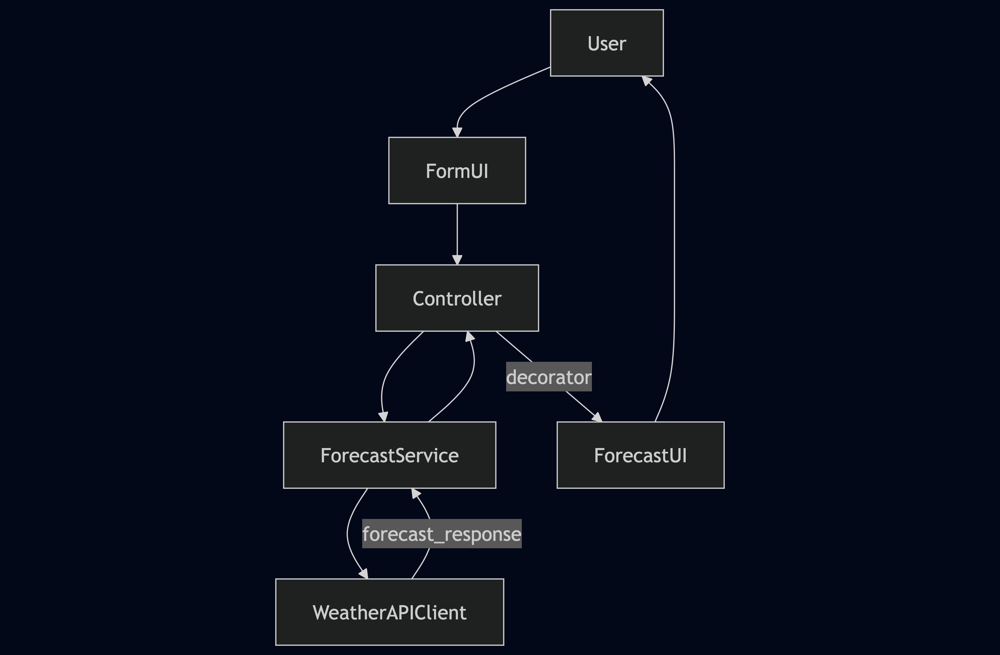
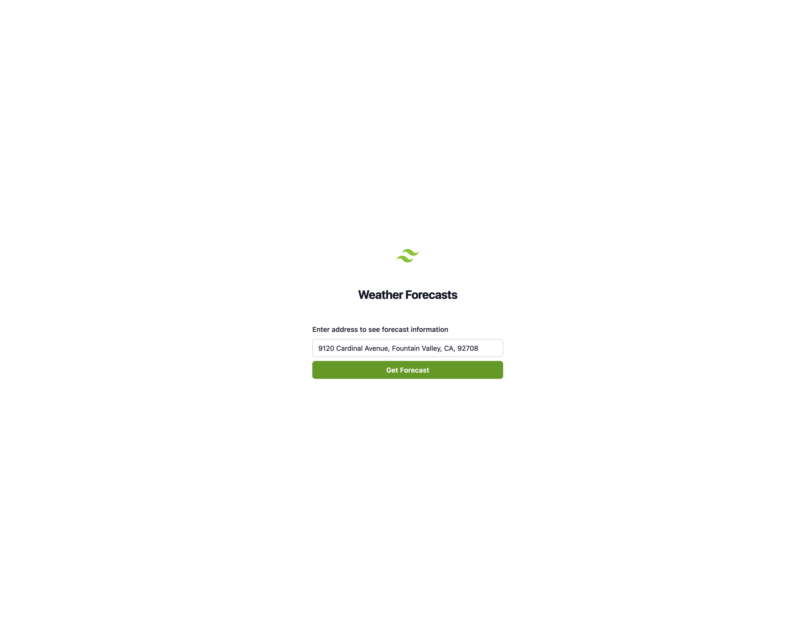
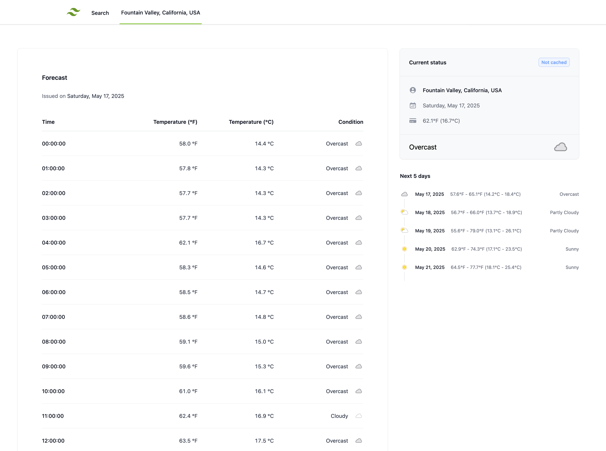

# README

## Weather App

A simple Ruby on Rails application that provides weather forecast for a given address. It fetches current and extended forecast data using WeatherAPI, caches results per ZIP code, and displays the result in a TailwindCSS-styled UI.

## Architecture & Design

### Assumptions & Considerations

- The user must provide an address that has a zip code.
- To aid the user in the address typing process, an auto-complete address feature was implemented via mapbox.
- When a user ends up typing or selecting an address that lacks a zip code, a fallback process can be triggered to get geocoordinates based on the address from a geo-location service. This would lack a zip code so that cache would not be set. Therefore, this was not implemented to avoid two types of simultaneous caching keys.
- If there is a zip code we can proceed with querying the forecast.
- An alternative cache key strategy can be rounding to 2 decimals geo-location coordinates, which does not affect the accuracy of the weather data returned back to the user. Affects by around ~1-10 kms.
- To facilitate user experience, forward geolocation can be used with an ambiguous address, to load possible addresses containing a zip code.

### Design choices

- The system is designed to support multiple weather APIs via an injectable client architecture.
- The `ForecastService` is responsible for handling the cache and delegating to the correct API client.
- Form objects handle input validation; decorators manage UI display logic.
- Weather data is cached per ZIP code for 30 minutes using `Rails.cache`.
- Stimulus is used to create a smooth, single-page address submission experience.
- Mock clients are injected in Cypress and test environments for speed and isolation.

### Future Improvements

- Add user authentication and favorites
- Support multi-language/localization for forecast terms
- Add background job to refresh cache asynchronously
- Handle more granular geocoding
- Support cache with geo-coordinates (rounded) when zip code is lacking.

### Web routes

- `/` (root) renders the same content as in `/forecasts`
- `/forecasts` where the user can submit the address
- `/forecasts/:address` renders the details of the address in the parameters

### Internal flow

The following diagram illustrates the flow from the user interface to the weather API client and back to the view layer:

<p align="center">
  
</p>

## UI

### Search UI

<p align="center">
  
</p>

### Results UI

<p align="center">
  
</p>

## Ruby version

- Ruby 3.3.0

## Configuration

1. Clone the repository.
2. Run `bundle install` to install dependencies.
3. Run `bundle exec rails db:create` to create the db.
4. Make sure your rails master key is set (config/master.key)
5. Set your [WeatherAPI](https://www.weatherapi.com/docs/) and [Mapbox](https://www.mapbox.com/) keys inside the credentials file:
   5.1 Run `EDITOR="code --wait" bundle exec rails credentials:edit`.
   5.2 Make sure it follows this structure:

   ```yaml
   mapbox:
     public_token: <...>

   development:
     weather_api_key: <...>

   test:
     weather_api_key: "test_key"

   production:
     weather_api_key: <...>
   ```

6. For development, the cache store is set to `:memory_store`. In production, it uses `:solid_cache_store`.

NOTE: There are no db-backed models but rails will require the existence of the db.

## How to run the application

```bash
bundle exec rails server`
```

Open your browser and type http://localhost:3000, you should see the "Weather Forecasts" initial page.

## How to run the tests

### RSpec

Run `bundle exec rspec` to execute the test suite. This includes system tests with capybara.

### Code coverage

> Code coverage reports are generated in `/coverage/index.html` when `COVERAGE=true` is set when running specs.

### Cypress

There is an initial set of tests with Cypress. To run them interactively follow these steps:

1. Run `yarn install`.
2. Run `npx cypress open`.
3. When the Cypress window opens choose E2E Testing.
4. Choose any browser.
5. Click Start E2E Testing...
6. Click on any of the listed tests.

To simply run all Cypress tests run `npx cypress run`.

## Services

- Uses [WeatherAPI](https://www.weatherapi.com/docs/) for weather data

## Tech Stack

- Ruby on Rails 8.0.2
- Ruby 3.3.0
- HTTParty for HTTP requests
- Capybara + RSpec for testing
- Cypress for E2E browser tests
- Stimulus (via importmap-rails)
